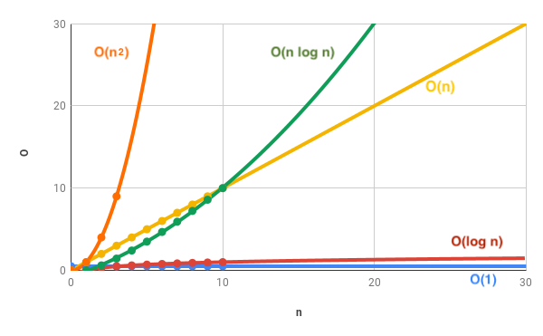

# Logs and Section Recap

## Logarithms

Sometimes big O expressions inolve more complex mathematical expressions.

**log2(8) = 3** Read as Log base 2 of 8 equals 3.

What is being calculated is 2, to what power equals 8. 2 _ 2 _ 2 = 8.

**log2(value) = exponent** is the inverse of **2exponent = value**

> The logarithm of a number roughly measures the number of times you can divide that number by 2 **before you get a value that's less than or equal to one**

**log(8)=3**

- 8 / 2 = 4
- 4 / 2 = 2
- 2 / 2 = 1

**log(25) = 4.64**

- 25 / 2 = 12.5
- 12.5 / 2 = 6.25
- 6.25 / 2 = 3.125
- 3.125 / 2 = 1.5625
- 1.5625 / 2 = 0.78125

## Logarithm Complexity

Logarithmic time complexity is great!

## Who Cares?

- Certain searching algorithms have logarithmic time complexity.
- Efficient sorting algorithms involve logarithms.
- Recursion sometimes involves logarithmic space complexity.
